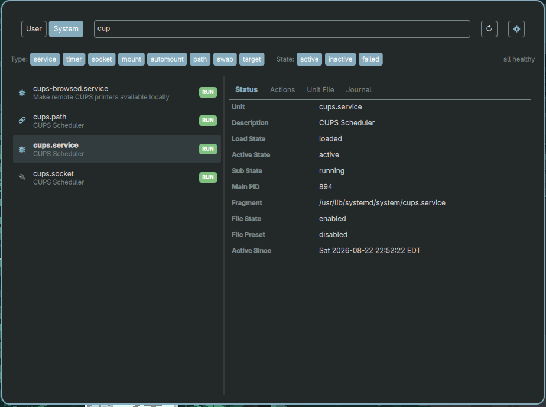
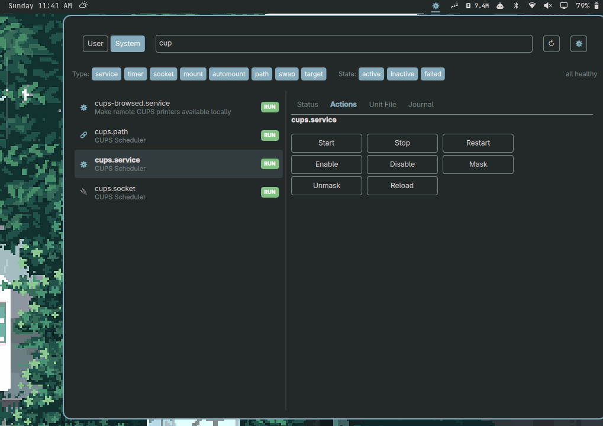

# oSystemd

**Manage systemd units from the Omarchy bar.**

List, search, filter, inspect, start/stop, enable/disable, mask, and view unit
files and journals — all from a compact bar widget and a rich panel UI.

## Features

- **List & Search** — View all units with real-time filtering by name or description.
- **Type & State Filters** — Chip-based toggles for service, timer, socket, mount, and more; filter by active/inactive/failed state.
- **Status Inspection** — Key fields at a glance: PID, load state, fragment path, activation timestamp.
- **Mutations** — Start, stop, restart, enable, disable, mask, unmask with confirmation-aware UI.
- **Unloaded Units Section** — View unit files installed on disk but not currently loaded by systemd (e.g., D-Bus-activated services like `fprintd`). Start, enable, disable, or mask them from the same panel.
- **Unit File Viewer** — Monospace rendering of unit file contents via `systemctl cat`.
- **Journal Peek** — Tail recent journal lines for any unit without leaving the panel.
- **Scope Toggle** — Switch between user and system scope instantly; system mutations invoke `systemctl` directly (a polkit agent may prompt for authentication).
- **Bar Indicator** — Traffic-light dot with tooltip; pulses on failures, shows count badge.
- **Persistent Settings** — Type filters, state filters, refresh interval, and pinned units survive restarts via `settings.json`.

## Install

```bash
omarchy plugin add https://github.com/rickycbanks/osystemd.git
```

Then restart `omarchy-shell` (or wait for the shell to auto-detect the new plugin).

### Remove

```bash
omarchy-plugin-remove io.github.rickycbanks.osystemd
```

## Polkit Setup

System-scope mutations invoke `systemctl` directly. If your user has the
appropriate privileges, the action succeeds. Otherwise a polkit authentication
agent in your session may prompt for a password.

Ensure a polkit agent (e.g. `polkit-gnome` or Omarchy's built-in
`Quickshell.Services.Polkit` agent) is running. For details and important
security notes about previous pkexec-based elevation, see
[polkit/README.md](polkit/README.md).

## Configuration

Settings are stored as JSON at:

```
~/.local/state/quickshell/by-shell/<shell>/plugins/io.github.rickycbanks.osystemd/settings.json
```

| Field               | Type             | Default   | Description                                     |
|---------------------|------------------|-----------|-------------------------------------------------|
| `scope`             | string           | `"user"`  | `"user"` or `"system"`                          |
| `refreshIntervalMs` | int              | `30000`   | Auto-refresh interval in milliseconds            |
| `journalLines`      | int              | `100`     | Number of journal lines to fetch                |
| `typeFilter`        | list\<string\>   | (all)     | Unit types to show                              |
| `stateFilter`       | list\<string\>   | (active, inactive, failed) | Unit states to show       |
| `pinned`            | list\<string\>   | `[]`      | Unit names pinned to the top of the list        |

## Screenshots

[]

[]


## Credits

- [lgse/sandman](https://github.com/lgse/sandman) — Omarchy plugin patterns
- [Quickshell](https://quickshell.outfoxxed.me/) — QML shell framework
- [Omarchy](https://github.com/basecamp/omarchy) — Desktop environment
- [systemd](https://systemd.io/) — The init system

## License

[MIT](LICENSE)
